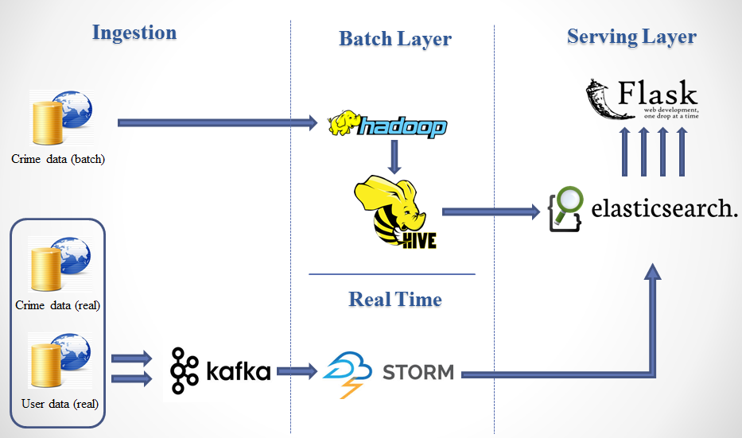

CrimeX
=================

[CrimeX](http://www.crimefighter.ninja) was my big data project as part of [Insight Data Science's](http://insightdataengineering.com/) Engineering fellowship program from September 2015 through October 2015

## Intro
**CrimeX** is an open-source data pipeline to analyse and visualize crimes and alerting nearby users in real-time. It includes a map for batch view that let user search for any location and provide crime distribution as of today and over the last 2 years for different crimes.

It makes use of the following technologies:

- Apache Zookeeper 3.4.6
- Apache Kafka 0.8.2.1
- Apache Storm 0.9.5
- Elasticsearch 1.5.2
- Flask with the following frameworks: [Google Maps](https://developers.google.com/maps/documentation/javascript/), jQuery, [Bootstrap](http://getbootstrap.com/)
- [Kafka-Python](https://github.com/mumrah/kafka-python) 0.9.2 (Kafka with Python)
- [pyleus](https://github.com/Yelp/pyleus 0.2.4) (Storm with Python)
- [pyelasticsearch](https://github.com/pyelasticsearch/pyelasticsearch) 1.3 (Elasticsearch with Python)
- [kafka-manager](https://github.com/yahoo/kafka-manager) 1.2.4

## Live Demo
A [live demo](http://www.crimefighter.ninja) is currently (October 2015) running.
[Demo video](https://www.youtube.com/watch?v=ZKI5gnJ2KDE) is currently available on YouTube.

Read further for more details about the project

## The Data

To simulate user movement, I wrote a producer script (python) that generates users' locations randomly all over the United States.

To simulate crimes, I wrote a producer script (python) that generates crimes randomly all over the united states.

## Pipeline Overview

## Realtime Processing

I used **Apache Storm** to provide real-time data processing.
- A 4-node cluster with 3 supervisors.
- 2 topologies: one to process user location updates and one to process each crime occurance.
- Each topology consists of a kafka-spout and a bolt
- The Storm topology is loaded via **Pyleus**.

## Install And Setup:

Instructions are specific to Ubuntu.

### Elasticsearch

#### The following [instruction](https://www.elastic.co/guide/en/elasticsearch/reference/current/setup-repositories.html) is for installing and running elasticsearch as a service

	wget -qO - https://packages.elastic.co/GPG-KEY-elasticsearch | sudo apt-key add -
	echo "deb http://packages.elastic.co/elasticsearch/1.6/debian stable main" | sudo tee -a /etc/apt/sources.list
	sudo apt-get update && sudo apt-get install elasticsearch
	
	#if you're using AWS instaces, the following plugin will allows the nodes in the cluster to discover each other.
	sudo /usr/share/elasticsearch/bin/plugin install elasticsearch/elasticsearch-cloud-aws/2.5.0

##### Here are a few useful [directories](https://www.elastic.co/guide/en/elasticsearch/reference/current/setup-dir-layout.html)

###### Plugins
/usr/share/elasticsearch/bin/plugin

###### Logs
/var/log/elasticsearch/

###### Config
/etc/elasticsearch/

#### Now you can start your service
	sudo /etc/init.d/elasticsearch start
	
### ZOOKEEPER
Coming soon.

### KAFKA
Coming soon.

### STORM
Coming soon.

#### Topologies logging
The topologies send their logs to the **pyleus** directory in **/tmp** so please make sure it exists on all supervisor nodes.  You'll also need to do this in the nimbus node if you wish to run the topology locally.

	cd /tmp
	mkdir pyleus

### Configuration files
Please see [configurations](config) for the settings I use for my set up.
 
### Storm
#### Master node: Nimbus and UI daemons
Add the following lines to **/etc/supervisord.conf/storm.conf** on the nimbus node:

	[program:storm-nimbus]
	command=/usr/local/storm/bin/storm nimbus
	user=ubuntu
	autostart=true
	autorestart=true
	startsecs=10
	startretries=999
	log_stdout=true
	log_stderr=true
	logfile=/usr/local/storm/logs/nimbus.out
	logfile_maxbytes=20MB
	logfile_backups=10

	[program:storm-ui]
	command=/usr/local/storm/bin/storm ui
	user=ubuntu
	autostart=true
	autorestart=true
	startsecs=10
	startretries=999
	log_stdout=true
	log_stderr=true
	logfile=/usr/local/storm/logs/ui.out
	logfile_maxbytes=20MB
	logfile_backups=10

#### Superivsor nodes: supervisor daemons
Add the following lines to **/etc/supervisord.conf/storm.conf** on all the superviosr nodes:

	[program:storm-supervisor]
	command=/usr/local/storm/bin/storm supervisor
	user=ubuntu
	autostart=true
	autorestart=true
	startsecs=10
	startretries=999
	log_stdout=true
	log_stderr=true
	logfile=/usr/local/storm/logs/supervisor.out
	logfile_maxbytes=20MB
	logfile_backups=10

### Kafka

Add the following lines to **/etc/supervisord.conf/kafka.conf** on all the kafka nodes:

	[program:kafka]
	command=pidproxy /var/run/kafka.pid /usr/local/kafka/bin/kafka-server-start.sh /usr/local/kafka/config/server.properties
	user=ubuntu
	autostart=false
	autorestart=true
	startsecs=10
	startretries=999
	log_stdout=true
	log_stderr=true
	logfile=/usr/local/kafka/logs/supervisord-kafka.out
	logfile_maxbytes=20MB
	logfile_backups=10
	stopasgroup=true

* If you want to enable JMX port, add the following line to **kafka-server-start.sh**

		export JMX_PORT=${JMX_PORT:-9999}
	
* Kafka are not set to autorun on first start up because we want zookeeper to be up and running firt.  Start kafka manually after checking that zookeeper is up and running.  You only have to do this once when you first set up the cluster or when the instance reboot.
		
		# verify that zookeeper is up
		sudo supervisorctl status
	
		# start kafka manually
		sudo supervisorctl start kafka
	
### Zookeeper

Add the following lines to **/etc/supervisord.conf/zookeeper.conf** on all the zookeeper nodes:

	[program:zookeeper]
	command=/usr/local/zookeeper/bin/zkServer.sh start-foreground
	autostart=true
	autorestart=true
	stopsignal=KILL
	user=ubuntu
	stderr_logfile=/usr/local/zookeeper/logs/zk.err.log
	stdout_logfile=/usr/local/zookeeper/logs/zk.out.log

## Presentation Deck
My presentation slides are available at [slideshare](http://www.slideshare.net/tajtaj/tajinder-presentation3).

